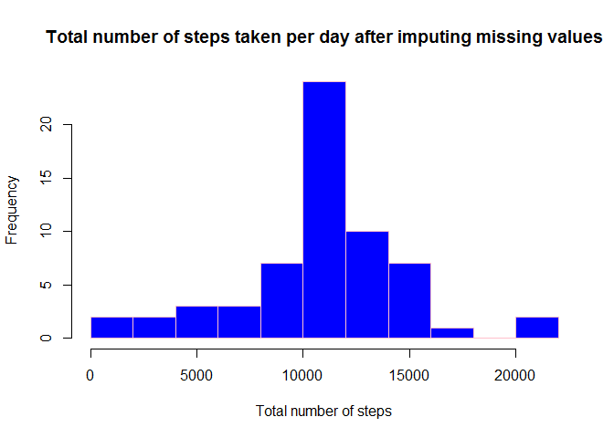

# Reproducible Research: Peer Assessment 1


```r
library(lubridate)
library(plyr)
library(ggplot2)
```

## Loading and preprocessing the data

```r
unzip("activity.zip")
data <- read.csv("activity.csv")
```

## What is mean total number of steps taken per day?

```r
tns_day <- tapply(data[,1], data[,2], sum, na.rm=T)
hist(tns_day,breaks=8, col = "blue", border = "pink", xlab="Total number of steps", 
     main="Total number of steps taken per day", ylim=c(0,20))
```

 

```r
mn1 <- mean(tns_day, na.rm=T)
md1 <- median(tns_day, na.rm=T)
```
Mean of the total number of steps taken per day: **9354.2295**   
Median of the total number of steps taken per day: **10395**   

## What is the average daily activity pattern?
Vector of means of number of steps per 5-minute interval

```r
avap <- tapply(data[,1], data[,3], mean, na.rm=T)
```

Time series plot

```r
plot(as.numeric(names(avap)), avap, type="l", main="Average daily activity pattern", 
     xlab="5 minute interval", ylab="average number of steps taken")
```

 


```r
maxns <- names(which.max(avap))
```
5-minute interval containing the maximum number of steps is **835**

## Imputing missing values


```r
mvn <- summary(data[,1])["NA's"]
```

Total number of missing values is **2304**

Creating a new dataset and replacing NAs by mean values from 'avap' vector created in previous step

```r
data2 <- data

for(row in 1:nrow(data2)) {
  if(is.na(data2[row,1])) data2[row,1] <- avap[as.character(data2[row,3])]
}

tns_day2 <- tapply(data2[,1], data2[,2], sum)

hist(tns_day2,breaks=8, col = "blue", border = "pink", xlab="Total number of steps", 
     main="Total number of steps taken per day after imputing missing values")
```

 

```r
mn2 <- mean(tns_day2)
md2 <- median(tns_day2)
```

After imputing missing values we have the following values:    
- Mean of the total number of steps taken per day is **10766.1887**   
- Median of the total number of steps taken per day is **10766.1887**   

We see that estimates of the total daily number of steps are higher than before imputing missing values

## Are there differences in activity patterns between weekdays and weekends?

```r
data2 <- transform(data2, weekdt = ifelse(wday(as.Date(data2[,2])) %in% c(1,7), "weekend", "weekday"))
data3 <- ddply(data2, .(interval,weekdt), summarise, avns=mean(steps))

g <- ggplot(data3, aes(interval, avns))
g <- g + geom_line(aes(colour=weekdt), size=1) + facet_wrap(~ weekdt, nrow=2, ncol=1) 
g <- g + labs(x="Interval", y="Number of steps") 
g + labs(title = "Weekend / weekday average number of steps") + labs(colour="Week day type")
```

 

We see that on weekdays the most active period falls to the time between 8 and 9 AM with much less active period for the rest of the day.   
On weekends activity is distributed more evenly across all day.   
